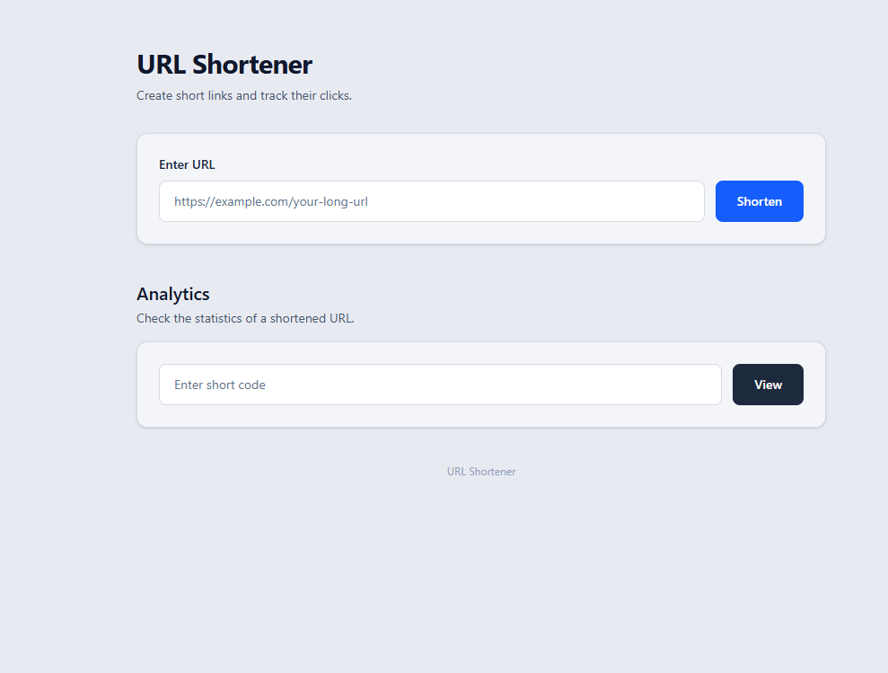

# LinkSnap — Distributed URL Shortener

A URL shortener where the redirect never waits on non-critical work: Redis
caches hot links, click counting runs asynchronously in the background,
and Redis-backed rate limiting protects link creation from abuse.



**Live demo:** [linksnap-frontend-o0zh.onrender.com](https://linksnap-frontend-o0zh.onrender.com)
*(free-tier hosting — first request may take 10–30s to wake up)*

## Features

- Base62-encoded short codes (no collision-checking needed — reuses MySQL's auto-increment ID)
- Redis cache-aside pattern → sub-millisecond redirects on a cache hit
- Async click tracking via Spring `@Async` — redirect never blocks on the DB write
- IP-based rate limiting on link creation (Redis atomic `INCR`, fixed window)
- Dockerized (multi-stage builds), deployed on Render — MySQL on Aiven

## Tech Stack

**Backend:** Java, Spring Boot, Spring Data JPA, Spring Data Redis, MySQL, Redis, Maven
**Frontend:** React, Tailwind CSS, Vite
**Infra:** Docker, Nginx, Render, Aiven

## How It Works

1. **Create:** save row → base62-encode the ID into a short code → write to Redis immediately.
2. **Redirect:** check Redis first, fall back to MySQL on a miss → fire async click count → return redirect instantly.
3. **Rate limit:** atomic Redis `INCR` per IP, 1-minute window, `429` past the limit — creation endpoint only, redirects unaffected.

## API

| Method | Endpoint | Description |
|---|---|---|
| `POST` | `/api/shorten` | Body: `{ "longUrl": "..." }` |
| `GET` | `/{code}` | Redirect to original URL |
| `GET` | `/api/analytics/{code}` | Click count + metadata |

## Running Locally

```bash
# backend (needs local MySQL + Redis)
./mvnw spring-boot:run

# frontend
cd url-shortner-frontend
npm install && npm run dev
```

## Key Tradeoffs

- **`@Async` over Kafka:** kept click-tracking async but stayed within a stack I can fully explain, instead of adding a queue I'd only shallowly understand. Cost: a crash mid-write can drop a click — acceptable here, not for stricter durability needs.
- **Cache-aside, not write-through:** Redis stays a pure performance layer — if it goes down, requests just fall back to MySQL and still work, only slower.

## Next Up

Kafka for durable async processing · sliding-window rate limiting · integration tests · CI/CD

---

Built by [Vishvatej Surve] · [LinkedIn](https://linkedin.com/in/vishvatej-surve-4136a1252)
